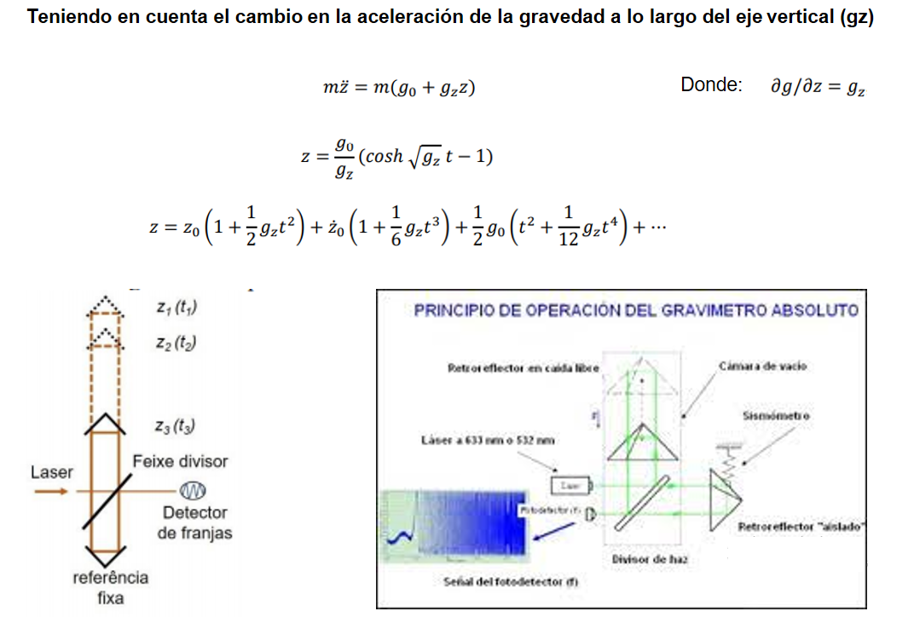
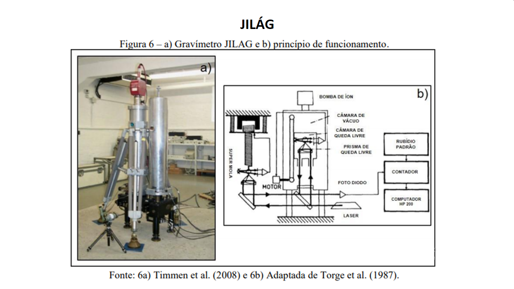
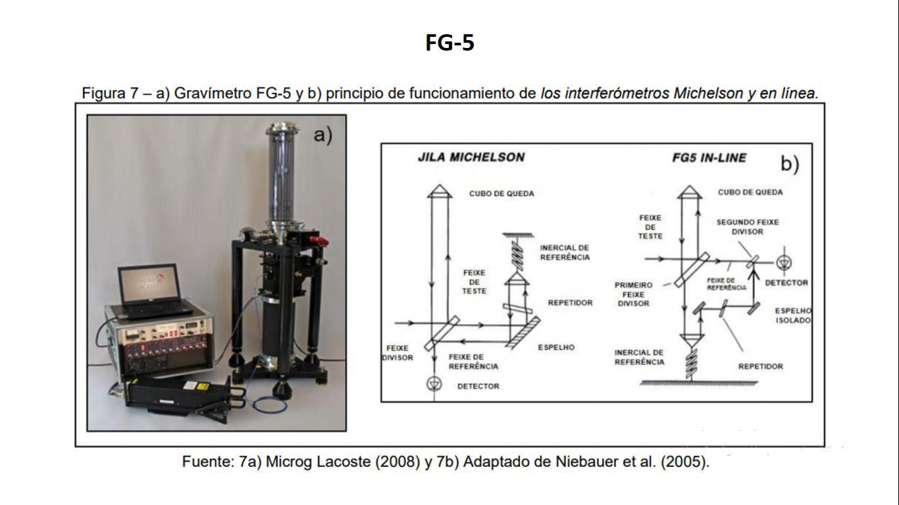
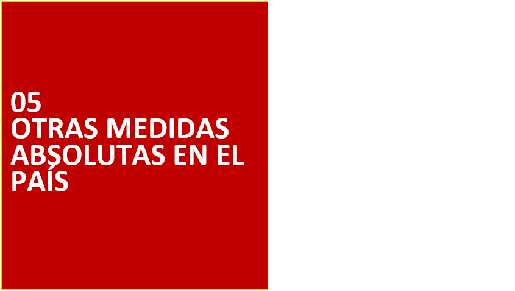

#
{width=2000 height=680}

#
{width=2000 height=680}

#
{width=2000 height=680}

#
{width=2000 height=680}

## GEODESIA FÍSICA

{width=1000 height=550}

##
{width=2000 height=680}

##
{width=2000 height=680}

##
{width=2000 height=680}

##
{width=2000 height=680}

##
{width=2000 height=680}

##
{width=2000 height=680}

##
{width=2000 height=680}

##
{width=2000 height=680}

##
{width=2000 height=680}

##
{width=2000 height=680}

##
{width=2000 height=680}

##
{width=2000 height=680}

##
{width=2000 height=680}

##
{width=2000 height=680}

##
{width=2000 height=680}

##
{width=2000 height=680}

##
{width=2000 height=680}

##
{width=2000 height=680}

##
{width=2000 height=680}

##
{width=2000 height=680}

##
{width=2000 height=680}

##
{width=2000 height=680}

##
{width=2000 height=680}

##
{width=2000 height=680}

##
{width=2000 height=680}

##
{width=2000 height=680}

##
{width=2000 height=680}

##
{width=2000 height=680}

